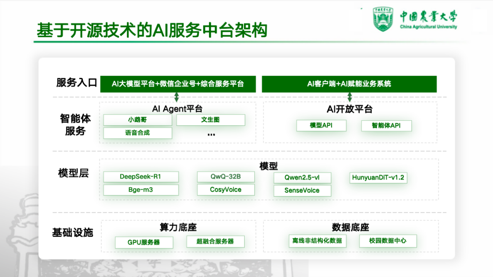
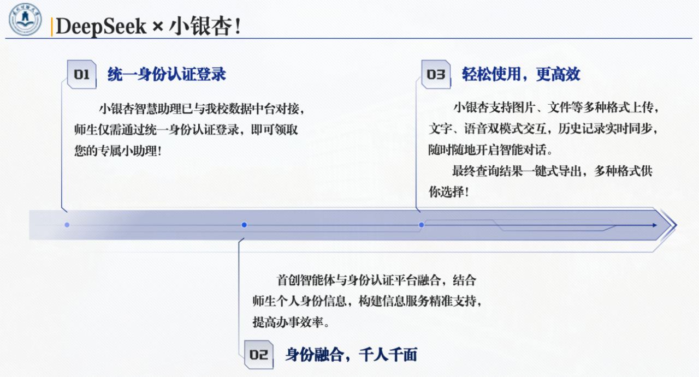
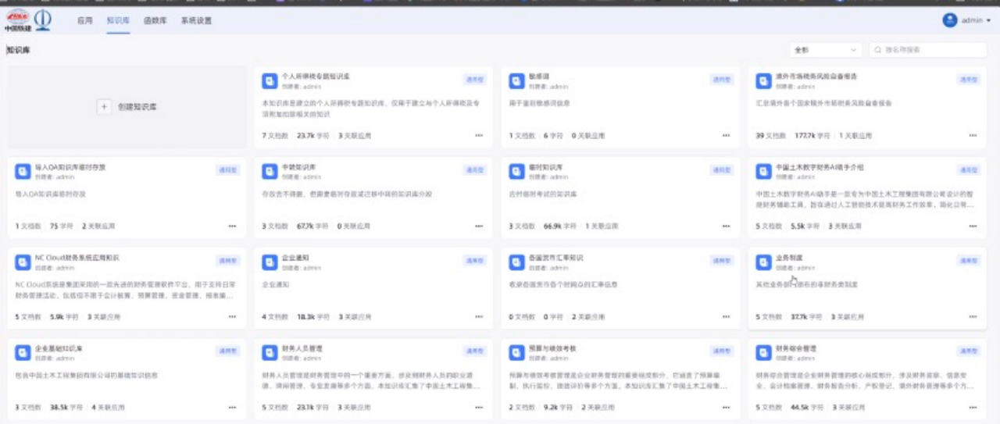
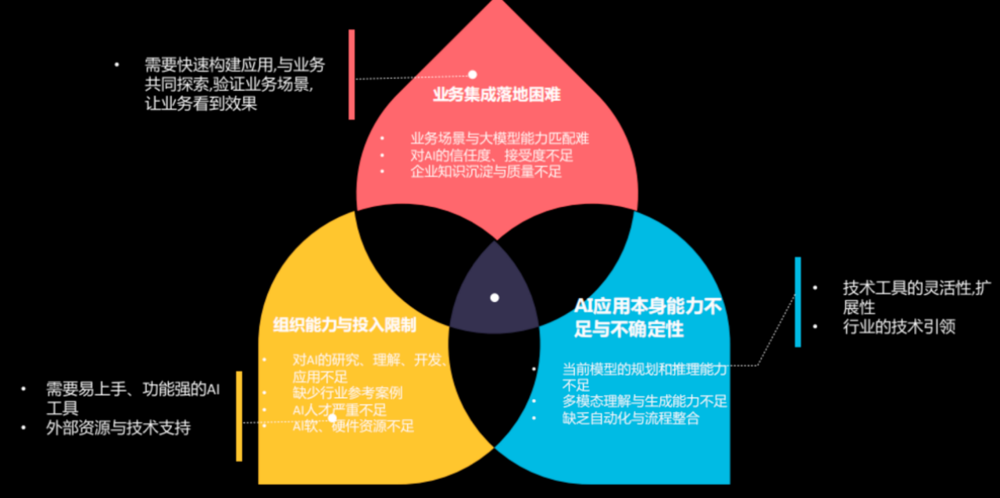
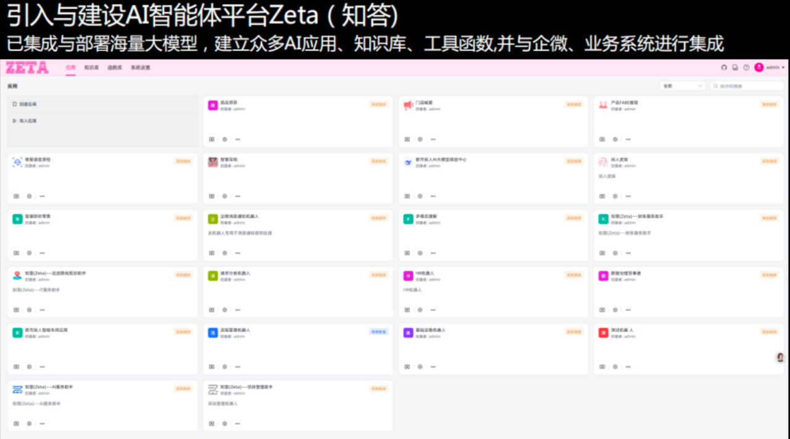

# 12.企业智能体建设成功案例
## 12.1.中国农业大学构建“小鹉哥”助力师生咨询及科研教学
### 12.1.1.中国农业大学介绍
中国农业大学，简称“中国农大”，坐落于北京市，是中华人民共和国教育部直属高校，直管副部级建制，位列国家“双一流”、“985 工程”、“211 工程”重点建设高校，是我国现代农业高等教育的起源地。学校起源于 1905 年成立的京师大学堂农科大学，历史底蕴深厚。现已发展成为一所以农学、生命科学、农业工程和食品科学为特色和优势的研究型大学，形成了农、工、理、经、管、法、文、医、哲等多学科协调发展的格局。学校设有北京海淀西校区、东校区和烟台研究院等教学科研园区。作为中国农业领域的最高学府，中国农业大学在生物育种、食品安全、农业资源与环境、乡村振兴等关键领域承担着国家级重大科研任务，汇聚了大量顶尖人才，为国家粮食安全、农业现代化发展和生态文明建设做出了卓越贡献，被誉为“中国农业人才的摇篮”。

### 12.1.2. AI 转型需求
作为中国农业高等教育的旗帜，中国农业大学致力于打造一座以 AI 为核心驱动力的“未来智慧校园”。MaxKB 助力中国农业大学搭建师生咨询服务智能体，科研与教学分析智能体。这不仅是一次技术升级，更是一场深刻的教育范式革命。通过人工智能技术，无缝融入教学、科研、学习、管理与生活的每一个角落，为师生创造一个更高效、更个性化、更富创造力的成长与发展环境。
- **教学革新**： 需构建AI辅助教学智能体，赋能教师开发智能课件、实现个性化作业批改与反馈，并基于学习数据分析实施精准教学干预，打造智慧课堂。
- **科研赋能**： 需建设校级AI科研智能体，集成农业大数据、生物信息等特色数据集，支持跨学科团队开展智能育种、智慧农业、食品科学等前沿领域的AI融合创新研究。
- **管理增效**： 需部署AI驱动的校园智慧管理智能体，整合各部门数据，实现生源预测、财务智能分析、安全风险预警、设备运维提醒等，提升决策科学性与管理运行效率。
- **学习变革**： 需为学生提供个性化学习智能体，可根据其知识薄弱点推荐学习路径，并提供7x24小时智能答疑，培养学生自主性与探究式学习能力。
- **服务升级**： 需打造一站式AI智慧生活服务智能体，集成智能客服、餐饮推荐、后勤感管理等功能，通过智能化、精准化的服务提升师生校园生活品质与幸福感。

### 12.1.3. AI 基础架构
针对上述 AI 转型的需求，学校规划了 AI 整体技术架构，本架构旨在构建集约高效、自主可控的校园 AI 能力基座，共分四层：
- **算力基础设施层**： 作为底层支撑，整合校内 GPU 算力资源，建设高性能计算集群。通过虚拟化技术提供异构算力资源池，为模型训练与推理提供弹性、稳定的算力供给，并确保数据安全与隐私保护。
- **模型层**： 构建以“通用大模型+领域小模型”为核心的模型资源池。一方面集成或采购主流开源大模型（如 DeepSeek），另一方面基于农学、生命科学等优势学科数据，进行领域微调与训练，孵化具有校本特色的专用模型，形成核心竞争力。
- **智能体服务层**： 此为架构的核心能力层。基于底层模型，通过智能体（Agent）框架实现 AI 应用的落地。利用 RAG（检索增强生成）技术连接学校知识库与业务数据，开发流程自动化、数据分析、智能问答等 AI 原子能力，并以 API 接口形式向上层应用提供标准化服务。
- **服务入口层**： 作为最终用户触点，将 AI 能力无缝对接到全校师生的工作学习场景中。包括集成到校园门户、企业微信、教学平台、科研平台等现有应用，以及开发统一的 AI 助手入口，提供一致、便捷的交互体验。

### 12.1.4.为什么选择 MaxKB
中国农业大学最终选定 MaxKB 作为校园AI智能体（Agent）的核心支撑平台，主要基于其深度契合高校 AI 转型需求的四大核心优势，为教学、科研与管理数字化提供了可靠保障：
- **操作简单，易于上手**：MaxKB 提供极其直观的用户界面，无需深厚的 AI 技术背景即可快速完成知识库创建、模型配置与智能体部署。这极大降低了各院系和职能部门的使用门槛，有利于 AI 能力在全校范围内的快速推广与普及，节省了大量培训成本。
- **系统稳定可靠**：在测试过程中，其各版本表现均较为稳定，未出现影响使用的明显缺陷与致命 BUG。这种可靠性对于保障教学、科研、管理等核心业务的连续性和数据安全性至关重要，确保了平台能够胜任大规模、高并发的应用场景。
- **知识库问答能力出众**：平台基于 RAG 技术构建，在知识上传、向量化处理及语义检索方面表现高效，其问答功能针对中文场景优化良好，在测试中展现了较高的召回率与准确率，能有效满足师生对专业、精准信息检索的迫切需求。
- **模型中立性提供战略灵活性**：MaxKB 不绑定任何特定模型厂商，可无缝对接国内外主流大模型 API（如 DeepSeek、文心、通义等）。这一特性避免了技术锁定风险，使学校能根据具体场景的性能、成本与安全性要求，灵活选用或切换最佳模型。

图 21 ：中国农业大学 AI 服务中台架构

### 12.1.5.AI 转型建设成果：小鹉哥
AI 平台“小鹉哥”（基于 MaxKB 构建）正式上线以来，已快速融入师生日常，在以下四个方面展现出显著价值，成为校园工作、学习与生活的得力助手：
- **生活服务（便捷高效）**：平台已成为校园生活的“百事通”。师生可通过自然语言便捷查询班车时刻、校历安排、场馆开放时间等公共信息；更能准确获取诸如“宿舍断电充值”、“一卡通挂失补办”等常见事务的标准化处理流程，实现 7x24 小时的即时响应。
- **行政助管（降本提效）**： 平台有效减轻了行政人员的重复性咨询压力。老师们可就“差旅报销标准”、“课题项目申报流程”等复杂规章制度进行精准提问，AI 能快速定位并解读相关条款，提供标准化的办事指南，显著提高了行政管理效率。
- **学习助学（因材施教）**： 平台扮演了无处不在的“学业导师”角色。同学们可随时就“微观经济学的供求模型”、“文献阅读方法”等学习难题寻求解释与指导。AI 能提供个性化的解答与学习建议，有效补充了课堂教学，支持了学生的自主探究与个性化学习需求。
- **科研助研（激发创新）**： 平台初步展现出作为“科研助理”的潜力。研究人员可指令其快速解析学术论文的核心观点、提炼研究框架；亦可帮助研究者高效进行文献综述、捕捉前沿动态、激发创新思路，为科研工作提供了新的智能化工具。

### 12.1.6.总结
MaxKB 与 DeepSeek 的结合，为高校提供了一条快速、高效落地大模型应用的可行路径。依托成熟开源技术整合，能够以较低成本构建符合自身需求的 AI 中台，大幅降低单位自主研发的技术门槛和资源投入。AI 赋能的核心在于为现有业务体系注入智能能力，其价值体现在对传统业务痛点的切实解决。因此，人工智能技术必须与具体业务场景深度融合，致力于提升效率、优化体验，才能真正推动数字化转型，实现技术与业务的双向赋能。

## 12.2.东北财经大学构建校园智慧 AI 助理 “小银杏”
### 12.2.1.东北财经大学介绍
东北财经大学位于辽宁大连，始建于 1952 年，是财政部、教育部与辽宁省共建的突出经济学、管理学优势和特色，经、管、法、文、理等多学科协调发展的财经大学。学校拥有应用经济学、统计学、工商管理三个 A 类学科，产业经济学、财政学等国家级重点学科，提供本科、硕士、博士完整人才培养体系。东财注重产学研结合，培养了大量高层次经济管理人才，被誉为“中国现代经济管理师的摇篮”。校园学术氛围浓厚，国际化程度较高，与多所海外高校保持合作，是中国具有重要影响的财经高等学府之一。

### 12.2.2.AI 转型需求
为引领财经教育 AI 转型，东北财经大学计划构建“数智东财”智慧教育新体系，全方位赋能教、学、研、管四大核心。
- **教学革新，AI 赋能教师提质增效**：推广 AI 备课辅助系统，为教师整合全球前沿财经案例与教学资源，一键生成个性化教案与习题。利用 AI 智能批改系统，实现客观题即时反馈与主观题智能批阅，解放教师劳力，使其聚焦于启发式、互动式教学。
- **学习变革，个性化全流程陪伴成长**：构建以学生为中心的智慧学习门户。课前，AI 助教推送预习资料并进行针对性前测；课中，基于数据分析支持分组与课堂有效讨论；课后，系统根据学习画像智能推荐拓展资源与进阶路径，实现课后自主拓展，培养终身学习能力。
- **科研创新，智慧平台驱动交叉融合**：打造财经大数据科研创新平台，集成多维度宏观经济、产业与企业数据，提供强大的计算能力与 AI 分析工具（如计量模型、文本分析），降低研究技术门槛，促进跨学科学术协作与前沿领域探索，催生高水平、创新性科研成果。
- **管理升级，数据驱动决策与精准服务**：建设校级智慧管理中枢，整合各业务系统数据。通过大数据分析，实现生源质量、教学质量、就业状况的全景评估与智能预警，提升管理效率与决策科学性，为师生提供精准、便捷的个性化服务，实现治理体系与治理能力现代化。

### 12.2.3.AI 转型之路
东北财经大学积极应对AI时代变革，系统推进AI技术与高校治理、教学科研及服务流程的深度融合，以智慧赋能发展，以创新重塑价值。基于 MaxKB 够构建与现有业务平台深度融合的 AI 智能体平台，东北财经大学在人工智能转型过程中的核心策略与实践思考如下：
- **团队组建先行**：学校高度重视人工智能转型中的人才与组织建设，系统推进跨学科、多背景的专业团队组建，为AI技术落地提供坚实支撑。
- **秉持长期发展理念**：人工智能技术迭代迅速，热点切换频繁。学校着眼于中长期规划，注重选择具备持续生命力的技术路线与应用架构，避免因短期技术变动影响整体布局。
- **坚持“应用为王”实施路径**：依托成熟的开源模型与平台，学校从易用性强、成效显著的轻量级应用切入，逐步拓展AI在管理、教学和服务等多维场景的覆盖。
- **打造校内智能问答助手**：当前重点推进基于RAG技术的智能问答系统建设，整合校内制度文件与办事流程，显著提升信息获取效率，增强师生对AI应用的体验感与认同感。
- **突出特色与风险控制并重**：针对高校人员结构清晰、角色权限相对固定的特点，系统设计时严格控制信息传播范围，强化数据隐私保护，确保AI应用安全合规、贴合教育实际。
- **推进系统融合与个性化服务**：实现与学校统一身份认证系统的深度融合，支持基于角色的分级访问，并结合用户上下文信息优化提示词设置，进一步提升问答准确性与服务针对性。
 
基于以上策略考量，东北财经大学最终选择 MaxKB 智能体平台作为 AI 应用开发平台。该产品凭借以下特性高度契合学校 AI 转型需求：
- **第一**：强大的 RAG 能力，可高效搭建本地 AI 知识库，支持文档上传与在线爬取，实现自动拆分与向量化处理，大幅提升问答效果；
- **第二**：快速接入第三方业务系统能力，无需编码即可嵌入企业微信、钉钉等平台，让现有系统快速获得智能问答功能；
- **第三**：产品坚持每月更新迭代，体现长期主义发展理念，确保持续优化与稳定服务。	
	通过 MaxKB 平台的引入及上述措施的协同推进，东北财经大学正在构建符合高校特色、具备扩展性和可持续性的人工智能应用生态，为教育数字化转型提供坚实支撑，助力学校在智慧教育领域实现创新突破。

### 12.2.4.AI 转型效果呈现：“小银杏”
“小银杏”作为东北财经大学基于 MaxKB 开发的校园智慧 AI 助理，其诞生标志着学校在人工智能与教育深度融合领域迈出关键一步：
- **智能核心与知识管理**，“小银杏”的核心是智能问答，其知识库采用分类树状结构和精细权限管理，整合14个业务部门，各类文档 200 多项，实现门户网站、教务网站等通知新闻自动采集入库，通过模型和人工标注进行向量化并入库。
- **认证融合与便捷访问**，MaxKB 平台与统一身份认证平台深度集成对接，构建企业级微门户一体化应用解决方案。通过单点登录，实现用户一次认证即可访问所有授权系统资源，同时支持通过微信公众号或企业微信实现一键授权调用功能。
“小银杏”从设计之初就旨在超越传统微门户，成为一个智能 PaaS 平台。它通过自然语言（NL）交互，打通异构系统，支持师生高效信息检索与业务办理，初步形成了“基础服务+学科延伸”的智慧生态。
 

图 22 ：“小银杏”移动端与PC端
 

图 23 ：“小银杏”与身份认证平台融合

 
### 12.2.5.总结
东北财经大学深刻认识到人工智能技术对高等教育的颠覆性影响，积极布局未来 AI 转型战略。通过将现有业务系统、内部数据库、制度规范与大模型深度融合，构建具有领域知识的“智慧大脑”，从而显著提升管理效能与教学科研创新力。东北财经大学基于 MaxKB 打造的“小银杏”智能平台，将成为学校 AI 战略转型的核心载体和创新引擎。该平台深度融合校内知识体系与 AI 能力，通过 RAG 技术实现精准知识服务，以“小银杏”为数字基座，学校将持续推进业务场景智能化重构，加速从“事务处理”向“自主决策”演进，逐步建成覆盖教学、管理、科研全场景的智能体生态。
 
## 12.3.弋阳县政府构建"弋心一意"小助手提升企业群众办事体验和满意度
### 12.3.1.弋阳县政府介绍
弋阳县是江西省上饶市下辖县，位于江西省东北部、信江中游，东邻横峰县，南接铅山县，西毗万年县、贵溪市，北连德兴市、乐平市。县域总面积 1580 平方公里。截至2023年末，常住人口约33.2万人。弋阳交通便利，浙赣铁路、沪昆高速铁路、320国道、沪昆高速公路穿境而过。经济以农业、工业和服务业为主导，形成了食品、建材、采矿等特色产业。

### 12.3.2.弋阳县政务服务大厅AI需求
弋阳县行政审批局将提升服务效能、优化群众办事体验作为工作的重中之重。近年来，行政审批局围绕“最多跑一次”改革目标取得了一定成效，但在实际工作中发现企业群众在政务服务大厅办事时，仍常受到以下两类问题的困扰：
- **问题一**：材料准备过程繁琐，不少群众和企业对申请材料的具体要求理解不清，准备时容易遗漏或格式不符，导致反复修改、补充，甚至不得不“多次跑”，费时又费力。
- **问题二**：咨询解答效率有待提高，尤其在办事高峰时段，咨询台压力大，简单问题占用大量人力，而一些相对复杂的问题却难以得到即时、专业的解答，影响了整体服务体验。
针对这些问题，行政审批局积极借助数字化手段寻求突破。行政审批局期望引入AI技术，打造一位24小时在线的“智能办事员”。
- **问题三**：AI智能导办和材料预审系统，为企业群众提供精准、清晰的材料清单和填报指引，实现“一次性告知、一次性办好”；
- **问题四**：AI客服高效解答大部分常规咨询，释放人力专注于处理复杂个案和提供更有温度的服务。希望AI的赋能将进一步提升服务效率与质量，让“最多跑一次”真正成为群众身边温暖而便捷的现实。

### 12.3.3.弋阳县政务服务大厅引入 AI 助手
为进一步提升政务服务质效，弋阳县积极探索“弋心一意+AI”智慧服务新模式，组织技术团队完成人工智能模型的本地化部署，融合 DeepSeek 与通义双大模型能力，以数据赋能推动企业群众办事便捷度和满意度再上新台阶。2025 年 2 月，基于 MaxKB 平台打造的“弋心一意”AI小助手正式在县政务服务大厅导服台投入使用。该助手通过系统梳理大厅各窗口高频事项的办事指南和材料流程，全面接入通义和 DeepSeek 大模型，并运用检索增强生成（RAG）技术，为企业群众提供精准、高效的政务咨询服务，实现了从“人找服务”到“服务找人”的智慧转变，真正让“弋心一意”成为弋阳政务便民利企的新名片。
 

图 24 ：“弋心一意”AI助手在政务大厅

### 12.3.4.企业群众收益
"弋心一意" AI 小助手已成为弋阳县政务服务中心“智慧政务”建设的一项标志性成果，有效提升了企业群众的办事体验和满意度。该助手通过深度融合 DeepSeek 与通义双大模型，结合检索增强生成（RAG）技术，实现了智能问答、材料一键预览和跨窗口联办功能，为企业群众提供清晰、精准的全程办事指引。在语音交互方面，“弋心一意” AI 小助手具备前端语音提问、后台实时语义识别与知识库精准检索能力，真正做到了以语音反馈快速解答问题，极大降低了群众使用门槛。系统实现了从“人机对话”到“业务即办”的高效衔接，切实解决了企业群众在办事过程中遇到的多种问题，显著提高了政务服务的响应速度和便捷度。“弋心一意”AI小助手已成为弋阳县便民服务体系中广受认可的数字化成果，充分体现了“弋心一意”服务品牌的技术内涵与人文温度。

### 12.3.5.未来展望
弋阳县将根据试点成效逐步丰富“弋心一意” AI 小助手的知识库，打通“弋心一意”管理系统，通过整合政务信息资源和政务数据，开发“弋心一意” AI 小助手特色应用，打通政务服务的“最后一米”，实现政务服务大厅和乡镇便民服务中心高效管理协作，提升办事效率，促进政务服务更加智能化，推动弋阳数字政府建设高质量发展。 
 
## 12.4.中国土木工程集团构建“财小问”智能体提升财务管理效率
### 12.4.1.中国土木工程集团有限公司介绍
中国土木工程集团有限公司（以下简称中土集团，CCECC）成立于1979年，是中国最早进入国际工程承包市场的大型国有企业之一，现为世界 500 强企业中国铁建股份有限公司的全资子公司。公司总部位于北京，业务遍及全球 100 多个国家和地区。中土集团以工程承包为核心业务，涵盖铁路、公路、桥梁、港口、城市轨道交通、市政工程等基础设施领域的设计、施工、运营全产业链。公司承建了众多标志性项目，包括被誉为“友谊之路”的坦赞铁路、东非第一条电气化铁路亚吉铁路，以及多项“一带一路”沿线国家的重大基础设施工程。凭借其卓越的工程质量和强大的综合实力，中土集团已发展成为全球知名的国际工程承包商，连续多年入选ENR全球最大 250 家国际承包商前列。

### 12.4.2. AI 财务场景需求
中国土木工程集团有限公司的财务部门，在财务管理过程中存在以下几个主要问题：
- **问题一**：财务信息更新快，海量的财务政策与法律法规更新迅速，传统的信息获取方式难以确保知识的实时性与准确性，存在合规风险。
- **问题二**：合同审核数量大、重复性高，依赖人工处理不仅消耗财务团队大量时间，也影响项目前期的推进效率。
- **问题三**：业务单据审核工作繁重，如报销与预付款流程，需投入大量人力进行基础性核对，制约了财务对战略决策的支持能力。	
	为解决上述痛点，公司期望引入人工智能技术，通过 AI 实现政策的智能追踪与解读、合同关键条款的自动筛查，以及业务单据的智能初审，从而大幅提升财务工作的效率与准确性。

### 12.4.3.通过 MaxKB 实现AI转型
中国土木工程集团有限公司积极推动财务部门的智能化转型，以应对财务知识更新频率高、合同审核数量大与单据审核速度慢的三大效率挑战。最终选择 MaxKB 智能体平台作为核心解决方案，成功构建了财务 AI 新范式。
- **针对海量法规**，集团利用 MaxKB 强大的 RAG 技术，将政策文献构建成精准知识库，通过智能问答快速获取权威解读，确保了合规时效性，推出了“财小问”AI 智能问答机器人。     
- **针对合同审核**，通过平台的工作流编排，自动联网核验乙方信息，并基于知识库条款智能审阅文本，极大提升了效率与风控水平。
- **针对单据审核**，工作流实现了与现有系统的对接，对报销、预付款等业务单据进行自动化初审，释放了人力。
MaxKB 凭借产品易于上手、RAG能力出色、工作流功能丰富、不断迭代，为中国土木工程集团财务部门数字化转型提供了强大、可靠的技术底座。

图 25 ： 中国土木工程集团 AI 平台

### 12.4.4.成效收益
通过部署使用 MaxKB 平台，中国土木工程集团财务部的AI转型取得了显著成效，为公司带来了多维度的价值提升。
- **风险控制层面**，基于精准知识库的智能问答确保了财务决策的实时合规性，大幅降低了因法规疏漏引发的运营风险。
- **运营效率层面**，合同与业务单据的自动化审核流程将员工从重复性事务中解放出来，审核时间显著缩短，人力成本有效降低，项目财务流程加速推进。
- **战略决策层面**，财务团队得以从基础操作转向高价值的分析与管理职能，为公司全球业务的精细化管理和战略规划提供了更强大的数据洞察力。
此次转型不仅提升了财务工作的质量与效率，更通过技术赋能强化了集团的核心竞争力，为未来的智能化管理奠定了坚实基础。
## 12.5.都市丽人构建“智慧导购”门店销售智能体提升销售业绩
### 12.5.1.都市丽人（中国）控股有限公司介绍
都市丽人（中国）控股有限公司（以下简称都是丽人）（股票代码：港交所：02298）是中国知名的内衣制造商和品牌运营商，于1998年由郑耀南在广东东莞创立。公司从最初十几平方米的小店，发展成为集研发、生产、仓储物流、销售与营运于一体的大型内衣品牌集团，并于2014年在港交所主板上市，被誉为“中国内衣第一股”。都市丽人旗下拥有“都市丽人”、“欧迪芬”、“都市缤纷派”、“都市丝语”等多个品牌，产品涵盖文胸、内衣、家居服、塑身衣、保暖衣等众多品类。其首创的“贴身衣物一站式采购”模式和大众快时尚定位，使其迅速扩张，巅峰时全国门店数超8000家，覆盖全国330多个城市。通过数字化转型、品牌革新、产品升级及渠道优化等措施，都市丽人持续致力于服务大众市场，成为国内具有影响力的内衣行业领军企业之一。

### 12.5.2.门店营销经营痛点
都市丽人作为国内内衣行业的领先企业，始终致力于零售效率与服务体验的提升。在推进AI 技术深度融合之前，公司在线下零售多项核心场景中面临以下痛点，制约了业务进一步标准化、规模化和智能化的发展：
- **痛点一**：营销内容生成高度依赖人力，门店引流效率低下，以往门店促销音频（如“喊麦”）需由区域或门店员工自行撰写文案并录制，过程繁琐、质量参差不齐，且难以快速响应营销节奏变化，人力成本高、产出效率低，无法支撑规模化、标准化的品牌宣传需求。
- **痛点二**：专业服务能力有限，顾客体验难以系统提升，在面对顾客身形与穿搭建议等专业需求时，一线人员多依赖个人经验，缺乏科学、统一的分析工具与推荐标准，导致服务质量不稳定，客户满意度参差不齐，也限制了高端产品和定制化服务的推广。
- **痛点三**：库存信息不透明，跨店调货效率低，门店查询库存长期依赖人工逐项核对或电话询问周边门店，耗时长、差错率高，不仅影响销售机会，也造成库存周转效率低，难以实现区域货品的高效协同与调度。
- **痛点四**：员工培训成本高，知识落地效果欠佳，传统培训方式难以覆盖全国数千门店的全体员工，新员工上手慢、产品更新信息传递延迟，一线人员对复杂产品卖点和客户议价场景应对能力不足，直接影响成交率和品牌专业形象。	
	这些业务痛点不仅大量占用人力资源，也阻碍了运营标准化与数字化水平的提升。正是基于以上背景，都市丽人坚定推动 AI 智能应用落地，以“智慧导购”系统为抓手，系统性地解决上述瓶颈，实现降本增效与服务升级，全面加速企业数字化转型升级进程。

### 12.5.3.AI 营销战略升级
都市丽人公司于 2025 年 2 月 28 日正式上线“智慧导购” AI 功能，该功能基于智能体平台MaxKB 进行开发，具备强大的学习与多场景应用能力，覆盖产品知识、零售策略及企业文化等多个维度，成为一线零售人员的智能助手、培训伙伴与行业顾问，全面赋能终端业务提质增效。                          
- **营销推广方面**，系统支持智能生成多种风格喊麦文案，并可灵活选择音色、音乐与话术风格，一键生成高质量语音素材，大幅降低门店引流宣传成本，实现每分钟内完成一条高质量语音导流内容。
- **顾客服务方面**，通过上传顾客全身照并描述产品需求，智慧导购可自动进行人物画像、身形与胸型等多维度分析，结合健康穿搭知识，提供专业的产品推荐建议，显著提升服务的精准性与专业性。
- **运营管理方面**，智慧导购可实现实时库存查询，支持根据产品信息快速检索本店及周边门店库存状况，增强货品调度效率，优化库存周转。
- **员工培训方面**，系统内置丰富的知识库，涵盖产品详情、销售技巧与企业文化等内容。员工可通过自然语言查询（如“女神杯卖点”）快速获取结构化反馈，包括产品背景、核心卖点及视频资料，还可针对典型客诉问题（如“产品价格高”）获取标准应对话术与解决方案。
AI 系统全面融入零售全场景，通过智能化工具显著降低人力和时间成本，强化了一线业务的支持体系，进一步推动公司 AI 转型升级。都市丽人在 AI 转型过程中选择 MaxKB 作为智能体开发平台，主要基于其模型中立、灵活易用等核心优势。MaxKB 支持快速接入与编排多种AI 模型，有效降低了系统开发与知识集成的复杂度，高效构建覆盖营销、服务、运营和培训的一体化智能助手，为“智慧导购”的迅速落地和持续迭代提供了可靠技术支撑。

图 26 ：AI 平台选型依据

图 27 ：基于 MaxKB 搭建的智慧导购平台

### 12.5.4.畅享未来 AI 
基于现有 AI 能力建设成果，都市丽人未来可进一步拓展人工智能技术在业务全链路中的深度融合与应用，以实现更全面的数字化、智能化转型。探索构建更加精准的用户全域画像系统，打通线上线下消费行为数据，结合 AI 预测分析能力，实现对顾客需求的超前预测与个性化商品推荐，进一步提升复购率和客户忠诚度。AI 技术在供应链管理中也具备广阔前景，如通过需求预测智能调节库存水位、自动补货，甚至协助设计端进行市场趋势分析与新品开发，实现“以销定产”的柔性供应链模式。都市丽人将持续推进 AI 在整个零售价值链中的集成创新，构建更智慧、更敏捷的新型零售生态，巩固品牌在行业内的科技领先地位与核心竞争力。	
 
## 12.6.深圳市深圳通有限公司构建 AI 智能客服提升客服效率并提高客户满意度
### 12.6.1.深圳市深圳通有限公司介绍
深圳市深圳通有限公司（以下简称深圳通）成立于 2004 年 12 月，是经深圳市政府批准，由市属国企深铁集团、巴士集团、运发集团和深港集团共同组建的国有企业，注册资本1亿元人民币。公司遵循“一张卡、一个标准、一个公司运营”的原则，负责深圳市电子交易收费系统（“深圳通”卡）的投资、建设与管理，旨在提高交易效率，便利市民，降低企业运营成本。深圳通主要经营智能IC 卡的开发、制作、销售、应用与充值，以及电子交易收费系统的技术开发、管理和信息咨询。截至目前，累计发卡量已超 5200 万张，互联网用户超过 4000 万。公司是国家级高新技术企业，在业务内涵、应用领域、技术储备和产品创新方面持续处于全国同行业前列。 

### 12.6.2.AI 发展需求
在全面推进 AI 技术升级之前，深圳通公司在多项业务场景中面临若干典型问题，制约了服务效率与用户体验的提升。
- **在客服系统方面**，传统应答方式严重依赖预设问答库，覆盖范围有限，难以应对用户多样化的实际咨询需求。很多超出常规业务范围的问题无法得到及时解答，导致用户体验较差，客服压力集中于高频重复类问题。
- **在业务流程方面**，用户需通过多层菜单选择才能抵达核心服务，操作路径冗长。例如办理学生卡延期等常见业务，也需多次点击跳转，效率低下，成功办理时长被人为拉长，用户流失率较高。
- **在日常运营层面**，客服模式属于典型的人力密集型，坐席人员日均处理业务量超过 250 次，重复劳动比例高，不仅工作强度大，且易因疲劳出现差错。同时新员工培训周期长，知识更新依赖人工传递，响应滞后。
- **在质量检测方面**，工作繁重，完全依靠人工抽检，覆盖率低、效率慢，难以系统性地改进服务质量；话术优化与知识提取缺乏智能化工具支持，员工多数时间用于机械性操作，而非真正解决复杂问题。
 	这些痛点共同促使深圳通引入 AI 技术，以实现从传统低效模式向智能化和人机协同化转型。

### 12.6.3.AI 智能体平台选型 
基于深圳通业务场景的需求，MaxKB 智能体凭借其独特优势成为理想的解决方案，其核心选择理由如下：
- **操作简单，快速部署应用**：MaxKB 提供直观的可视化操作界面，无需深厚技术背景即可轻松完成知识库构建与智能体配置，极大降低了AI应用的门槛。深圳通得以在短期内完成系统上线与迭代，有效加速了智能化转型进程。
- **模型中立，兼容性与可控性强**：MaxKB 不绑定特定模型供应商，支持多种主流大模型接入，企业可根据自身需求灵活选用最适合的模型，避免技术锁定风险。这一特点为深圳通提供了高度的自主性和适应能力，确保系统长期稳定运行。
- **工作流功能强大，支持复杂业务自动化**：MaxKB 具备灵活可定制的工作流设计能力，可无缝嵌入企业现有业务流程，实现多节点自动处理与人机协同。深圳通借此实现了客服、培训和质检等多环节的自动化升级，显著提升运营效率。
- **RAG 能力强大**：知识管理高效精准基于检索增强生成（RAG）技术，MaxKB 能够高效接入和实时更新企业内部知识库，确保回答内容准确、来源可靠，有效解决了传统客服知识覆盖有限的问题，同时大幅提高了信息检索与问答质量。

### 12.6.4.AI 成效收益
2025 年 2 月上旬，公司成功部署了 DeepSeek R1 70B 大模型和 MaxKB 智能体平台，开发出智能助理、合同审查辅助工具、制度智慧检索系统及智能营销支持工具等多个智能应用。至 2 月下旬，深圳通客服系统全面融合 DeepSeek 技术完成智能化改造，将为公众提供更加智能、高效和人性化的服务体验。
- **深圳通客服系统实现“全面响应”**：传统客服通常受限于预设问题库，难以涵盖各类实际咨询；现在借助大模型卓越的语义理解能力，该智能客服能够准确识别用户多种提问皆可得到清晰解答，真正做到“有问必答”。
- **深圳通客服系统的响应效率提升**：实现了从“多次点击”到“一步到位”的转变。该系统运用自然语言处理技术，能够迅速识别用户意图，减少冗余交互，摆脱传统多层菜单的繁琐操作。新一代智能客服通过自然语言对话直达用户需求核心。
- **深圳通客服系统实现显著赋能**：智能客服上线后，系统可自动应答超过 80% 的常规咨询，使人工坐席能更专注于复杂问题。实时知识库推送使新员工培训周期缩短 40% ，智能会话分析模块助力质检效率提升3倍。客服坐席处理业务的速度显著加快。

### 12.6.5.未来的展望
2025 年，深圳通接入 DeepSeek 大模型全面升级智能化客服，是技术赋能民生服务的重要实践。通过构建大模型的行业知识库与 Deepseek 的高效推理能力，深圳通客服系统在响应速度、准确率及用户体验上实现质的飞跃。这一升级不仅延续了深圳通公司在智慧交通领域的探索，更标志着 AI 技术进一步融入市民日常出行场景。近期，深圳通还将在“深圳通” App 上线“智能通宝”AI智能应用，作为出行助手进一步让用户畅享智能、精准的出行服务体验。深圳通公司的每一次创新都致力于让城市生活更便捷、更绿色、更智慧。未来，深圳通公司将持续利用AI技术为业务赋能，聚焦AI技术与公共交通行业的深度融合，构建公共交通领域数智化生态体系，探索智能推荐、多模态交互等新功能，让用户享受更贴心的便民服务。
