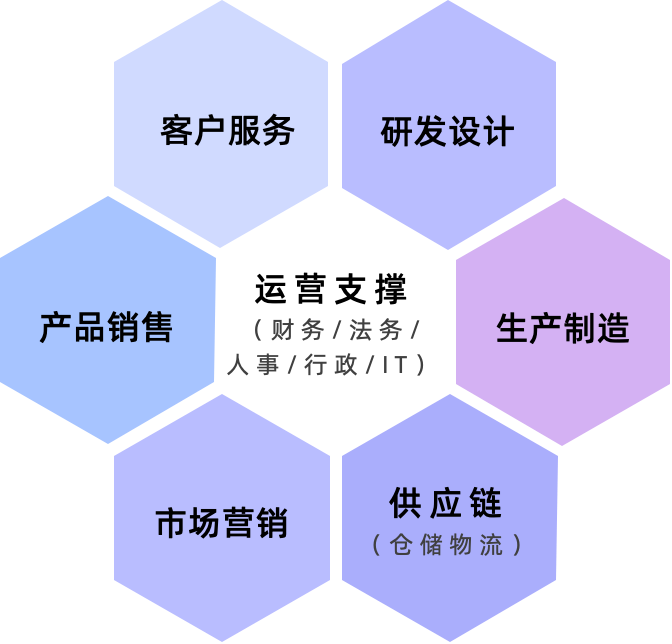

# 5.企业智能体的场景选择

## 5.1.坚持聚焦业务价值

如前所述，智能体场景选择的第一原则是聚焦业务价值。那如何做到这一点？关键要广泛接触业务部门。为什么这一点如此重要？因为在实践过程中智能体建设的负责人习惯在自己熟悉的业务领域寻找场景，并不自觉地陷入到优先在自己可控部门进行试点的陷阱。而智能体的业务价值很多时候并不在智能体建设部门，这样一开始就违背了聚焦业务价值这一根本原则。那如何避免这个陷阱？总结来说主要分成两点：
- **第一**，智能体建设负责人需要勇敢走出部门局限，去了解企业经营的全流程。对于大部分经营性企业，其业务经营领域基本可以归纳为下图的 “6+1 模型” （政府、教育与医疗行业特征与企业差距较大，但它们都有自己的类似模型。本白皮书聚集在企业领域，如果你希望了解政教医疗行业情况，可参考本白皮书成功案例中部分案例介绍）：

图 3 ：企业经营业务场景：“6+1” 模式

虽然不是每个企业都完整具备以上 “6+1” 模式的所有环节，但企业智能体建设部门还是可以按照这个模型去按图索骥，分析哪些部门是企业运营中的核心业务价值创造环节。
- **第二**，智能体建设负责人需要主动寻求“一把手”的支持，通过公司高层来统一不同部门对于智能体的认识并能够主动配合智能体部门的建设过程；在这个过程中，仔细了解每个部门的当前关切，并把部门关切与智能体价值建立关联，该关联则是寻求部门支持的关键。

## 5.2.坚持增效大于降本

在得到公司支持并和不同部门广泛沟通后，你或许会发现来自公司不同部门的很多真实业务场景，那如何选择？其实，如果站在场景所在部门视角思考这个问题，答案就会显而易见。大家都会优先把增效作为部门第一要务，因为增效是无上限的，而降本的极限就是部门归零。所以，智能体越是能够帮助部门增效，那就越有可能取得对应部门的支持。为此，我们应该优先关注智能体在帮助部门增效上的典型方向，具体如下：

- **提质增效（Efficiency）**： 这是智能体增效最直接的场景。通过自动化重复性且容易出错的流程性工作，将员工从繁琐的任务中解放出来，使其能够专注于更具创造性和探索性的工作。这类业务场景包括自动化审核、自动化报告、自动化摘要等。
- **增强能力（Empowerment）**： 智能体可以作为员工的“超级助理”，赋予员工高级专业技能。从而可以帮助员工做出更好的决策，提升其专业能力和工作效率。这类业务场景包括如销售技能助手、编程助手、设计助手等。
- **创新业务（Innovation）**： 智能体可以帮助企业探索新的商业模式和服务形态。通过将智能体与产品或服务相结合，可以为客户提供前所未有的个性化、定制化体验，从而创造新的市场和收入来源。这类业务场景包括个性化推荐、虚拟人导购等。
- **优化体验（Experience）**： 智能体能够提升企业内部员工和外部客户的体验。通过提供更智能、更便捷的交互方式，可以简化流程，提升满意度，从而增强用户粘性和忠诚度。这类业务场景包括智能客服机器人等。

有了以上四个主要方向，我们在落实“增效大于降本”这个场景选择原则时就有了抓手。当我们和不同部门沟通智能体场景时，就可以选择主动引导，而不是被动收集。例如，我们可以设计以下一组调研问题来引导不同部门（尤其是部门领导）自我发掘能够增效的有效场景：

表格 1 ：问题主题及业务价值识别意图
| 问题主题 | 业务价值识别意图 |
|----------|-----|
| 作为部门领导，你部门日常最消耗人力还经常出错的事情与任务是哪些？ | 提质增效。希望能找到解放部门人力资源瓶颈的关键场景。 | 
| 作为部门领导，你最希望团队人员快速提升的专业技能是哪些？ | 增强能力。希望能找到给团队提供专业技能的关键领域。 | 
| 作为部门领导，你最想尝试提升部门业绩的方向是哪些？ | 创新业务。希望能找到潜在的业绩提升突破方向。 | 
| 作为部门领导，你觉得你的用户当前最需要提升的体验是哪些？ | 优化体验。希望找到能改善当前用户体验的重要方向。 |

基于以上主动引导的问题主题，智能体构建团队可以更容易了解到不同部门真正能够通过智能体增效的业务场景。当然，在这个沟通过程中，也需要合理控制好不同部门对于智能体的价值预期。这也就是智能体建设公式中的第二个关键点，即角色定位。
