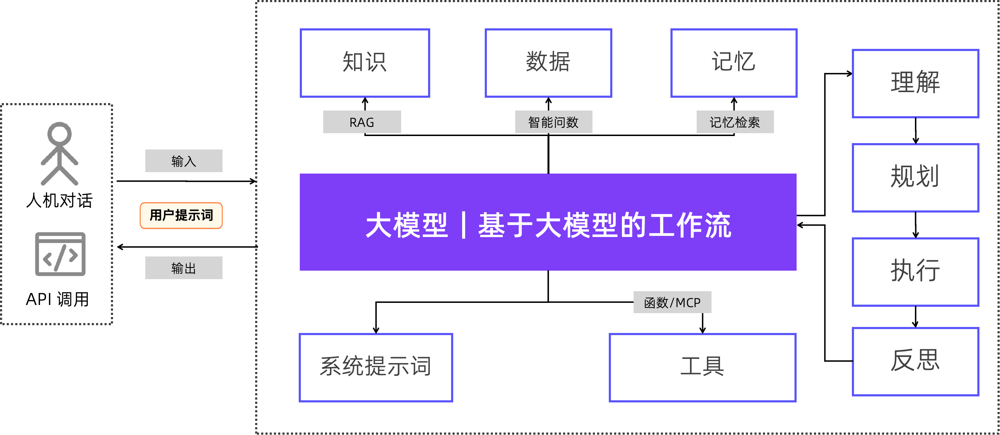

# 7.企业智能体的实现范式
在解决了智能体场景与角色定位问题后，智能体建设的环节就到了实现阶段。实现阶段涉及到非常多的技术要点和最佳实践。但如果对这些要点和实践进行总结和排序，实现范式是应该首先被关注到的地方。那何为智能体的实现范式？

**智能体实现范式是描述智能体在上下文规划以及工作流规划的典型范式**

其中，上下文规划是描述智能体运行时候需要那些上下文信息以及如何提供这些上下文。而工作流规划是描述智能体运行时候遵循的典型业务流程。要讲清楚智能体的上下文规划以及工作流规划，就需要首先了解智能体的标准技术架构。

## 7.1.智能体的标准技术架构
经过过去两年的发展，目前行业对于智能体的技术架构有了比较一致的认知。具体来说，其标准技术架构如下图所示：

图 5 ：智能体的标准技术架构

如上图所示，当一个智能体需要完成用户委托的一个任务，它需要构建以下关键技术模块：

- **大模型和基于大模型的工作流**：这是整个智能体的“大脑”，也是智能体能够表现出智能的关键所在。如果智能体需要完成的任务复杂度适中，将整个任务交给一个大模型从头到尾端到端完成即可。如果面临的问题足够复杂，智能体构建者可以利用人类经验把相关任务拆解成固定工作流，并在工作流的不同环节引入不同的大模型完成相应子任务。
- **知识**：企业内为完成当前智能体所需要的专属私有知识。这些知识大部分时候是存储在企业内的私有知识库（如文档），以非结构化数据为主。智能体内通过检索增强生成（RAG）技术获得需要的知识并作为上下文的一部分传给大模型。企业专属知识是抑制如大模型幻觉最有效的办法之一。
- **数据**：企业内的大量结构化数据存在传统关系型数据库内，而这些数据也是智能体完成很多高业务价值任务所必须的信息。通过构建可复用的智能问数能力，让智能体能够通过自然语言从关系型数据库获取必要的数据，并把这些数据作为上下文的一部分传给大模型进行任务的理解、规划、执行与评估反思。
- **记忆**：智能体在与用户持续交互过程中会产生对当前用户的记录（如用户提示词、用户对结果的反馈等）。这些记录对大模型给出符合用户期望的结果至关重要，也应该成为大模型上下文输入的一部分。目前，关于记忆模块的技术研究是非常火热的一个方向，但成熟主流技术仍然在沉淀过程中。在当前的实践中，用户过往一定轮次的对话记录时常成为记忆的主要来源。
- **工具**：智能体在运行过程中可能需要对外部系统做相应操作，这个操作执行就需要一系列定义清晰且对大模型友好的工具。对于工具的功能描述以及调用方式描述需要在上下文中一同传递给大模型。
- **系统提示词**：每个智能体都被定义为完成某些特定任务。而这些任务的任务描述，执行逻辑以及评价体系等可以用系统提示词固化到智能体内部，让智能体执行更加高效、准确。如你所预期，系统提示词也是传给大模型的上下文关键部分之一。系统提示词是智能体设计的关键环节，很多时候也是最耗费时间的环节。
- **用户提示词**：最终用户与智能体之间的交互方式有两种，一是“人机对话”模式，即用户利用自然语言向智能体下达任务并进行任务结果的反馈。二是 “API 调用”模式，即外部程序通过智能体暴露出来的 API 接口来调用智能体下达任务并提供反馈。无论是哪一种方式，用户提示词都是其核心内容。即用户要提供描述当前任务的提示词信息。需要注意的是，“人机对话”模式可以通过多轮对话方式来让智能体逐步明确用户任务的完整信息，而 “API 调用”模式一般则需要一次性提供关于当前任务的完整信息。

通过对智能体的标准技术架构分析，可以看出整个智能体实现过程中最核心的问题就是上下文规划以及工作流规划，所以由这两者构成的智能体实现范式就是关键。MaxKB 项目组基于过去实践的经验，将企业智能体常见的实现范式总结出下面六类。

## 7.2.咨询服务范式：企业知识的“智能交互门户”
### 7.2.1.业务需求
咨询服务类智能体可以作为企业知识的“智能交互门户”，面向企业内部需要解决知识分散、员工频繁咨询重复问题，占用大量人力等问题，而面向外部客户则需要解决咨询响应慢、服务体验差、最终影响品牌忠诚度等问题。咨询服务类智能体在电商、教育、物流、政府以及企业内部均有明确的落地场景，通过咨询服务类智能体提供 7*24 小时即时响应，一方面提升了用户体验，另一方面也大大降低了人工服务成本，提升了服务效率与服务一致性。咨询服务类智能体在企业的典型落地场景如：HR 政策、IT 故障、财务报销流程、产品使用指导、投诉处理、专业税务政策解读等。
### 7.2.2.实现范式
咨询服务类智能体的典型工作流程如下图所示：

图6 ：咨询服务类智能体工作流

- **用户输入**：咨询服务类可以通过文本、图片、log 日志等多种方式发起咨询，其中智能体构建平台可以通过文本输入、文件上传、接口输入以及表单收集等方式完成输入。
- **意图识别分类**：根据用户输入的咨询问题通过大语言模型进行意图识别，如果识别错误可以通过多轮对话、问题优化等进行意图再确认。
- **RAG 检索增强技术**：通过意图分类后进行对应知识、数据检索，检索完成后为了结果更加准确进一步通过多路召回将检索结果进一步重排序，最终提升检索结果准确性。其中多路召回支持跨知识库检索内容进行重排序。
- **答案生成及多轮对话引导**：通过 RAG 检索增强技术结合大语言模型生成格式化答案，如果生成的答案不符合用户需求，可以通过条件循环基于对话短期记忆重新引导用户进行多轮对话咨询服务，直到解决用户咨询的问题。
- **生成工单/转人工**：基于生成的回答，可以直接通过 API 调用生成工单或者对接客服系统转人工支持，为智能咨询服务提供人工兜底方案。

## 7.3.信息检索范式：企业信息获取的“智能导航”
### 7.3.1.业务需求
信息检索类智能体是企业信息获取的“智能导航”，企业信息在检索时经常会遇到复杂查询需通过多次拆分或者条件组合进行检索，不仅效率低下，而且准确率低，同时检索结果相关性低、可解释性也差，更无法溯源。信息检索类智能体通过对基础检索需求以及高级推理检索需求的能力定义，突破传统信息检索，可以提升信息检索的准确度与相关性，同时通过与 AI 结合增强检索可解读性，大大提升了用户使用效率及体验。企业内部典型实用场景包含：客户数据检索、合同数据检索、订单信息检索等。
### 7.3.2.实现范式
信息检索类智能体的典型工作流程如下所示：

图 7 ：信息检索类智能体工作流

- **用户输入**：通过文本信息输入或者表单收集等方式输入用户的信息检索需求。
- **意图识别及信息源定位**：结合大语言模型的意图识别能力进行信息检索分类，分类后根据不同的分类追溯到不同的信息源，其中信息源可以是数据、知识库以及 API 接口等。
- **生成检索条件**：基于用户问题以及数据源生成信息检索条件，比如典型的 SQL 语句，在检索条件生成节点可以定义条件生成规则，也可以定义条件生成示例，让检索条件生成的更加准确。 
- **信息检索**：通过调用函数工具或者 MCP 服务等执行信息检索，并对检索结果进行格式化输出。
- **解释检索结果并返回**：通过大语言模型基于信息检索结果、用户问题以及业务知识背景定义信息检索结果解释规则及格式，让检索结果可追溯，易理解。如果发现结果不准确则可通过条件循环再次进行意图识别及信息源定位，实现多轮对话最终满足信息检索要求。

## 7.4.内容生成范式：企业文档的“智能助手”
### 7.4.1.业务需求
内容生成类智能体是企业文档的“智能助手”，企业需频繁的生成重复性文档（如报告、邮PPT），人工编写效率低且格式不统一，内容创造还依赖个人能力，质量参差不齐，难以满足企业标准化需求。内容生成类智能体通过定义固定模版，用户输入信息后可以自动化生成格式化标准内容，快速提升高质量文档，减少人工编写时间，同时还可以保持内容一致性，确保生成的文档符合企业品牌规范与业务需求。企业典型应用场景如：周报、月报以及专项报告快速生成，邮件、通知、公文撰写等。
### 7.4.2.实现范式
内容生成类智能体的典型工作流程如下所示：

图 8 ：内容生成类智能体工作流

- **用户输入**：通过文本、图片以及 API 或者表单等方式输入内容生成的基本要求。
- **需求确认**：基于用户输入的内容通过大语言模型进行检查校准让用户进行需求确认，如果内容生成需求人工确认无误则进入下一个环节，如果内容生成需求不符合用户要求则引导用户进行多轮对话，最终确认需求。
- **内容融合及格式化生成**：基于输入的需求逐项进行内容格式化生成及合规性校验，其中内容生成通过提示词进行内容生成标准规范定义，合规校验可参考合规审核类智能体实现范式。在内容生成过程中我们可以通过知识库检索获取专业背景知识以及规章制度等信息，同时也可以调用工具获取外部参考标准信息，如企业工商信息查询获取客户基本信息等。逐项内容生成完成后再通过内容融合及一致性检查将整个输出内容进行融合并格式化输出，其中格式可以通过系统提示词或者知识库中的模版进行规则定义。
- **人工确认**：通过人工确认方式，确认内容融合及格式化生成内容是否无误，如果存在问题则通过条件循环进一步循环进入多轮对话重新进行内容生成；如果人工确认内容无误则进入文档输出环节。
- **文档输出**：文档输出节点可以通过工具或者 MCP 服务调用的方式将其转换为 Word、PDF、Excel、图片、数据库以及 API 数据等，将生成内容输出进一步使用。

## 7.5.信息提取范式：企业信息的“智能解构员”
### 7.5.1.业务需求
信息提取类智能体是企业信息的“智能解构员”，当前企业核心痛点及问题是在从非结构化的文本（如合同、发票、邮件）中提取关键信息时，人工提取效率低且易出错，与此同时准确的结构化数据缺失又进一步导致数据分析的不完整。信息提取类智能体可根据提取要求快速准确的完成信息提取，并以固定的格式将非结构化文本信息结构化准确输出，大大提升了信息提取的效率及准确度，并提升了数据的利用率。企业内部典型的落地场景如：合同信息提取、财务报表信息提取、客户评论反馈信息提取等。
### 7.5.2.实现范式
信息提取类智能体的典型工作流程如下所示：

图 9 ：信息提取类智能体工作流

- **用户输入**：通过文本、图片或者其它方式输入信息源介质，如 PDF、Word、图片、log 日志等。
- **信息识别**：通过文本内容提取、图片信息提取或者其他工具识别获取信息源介质中的原始信息。
- **信息提取及解析**：信息提取及解析可以分步骤逐个完成提取与解析，其中提取可以通过大语言模型定义信息提取规则，提取核心关键信息，然后通过解析工具将提取到的信息解析为格式化的内容，如 Markdown、JSON 等结构化格式。
- **信息整合及合规验证**：将逐项提取及解析得到信息进行整合及验证，信息整合主要是聚合，而验证则需要通过大语言模型进行合规检查验证，其中检查验证规则可以通过系统提示词定义挖掘大模型的能力完成，可参考合规审核类智能体实现范式。
- **人工确认**：对提取到的信息进行人工确认，确认过程可以通过表单或者条件循环方式实现，即人工确认没有问题则进入下一个环节，如果存在问题则进入循环体重新进行信息提取解析或者通过多轮对话进行人工修正等。
- **结构化输出**：结构化输出则是将提取到的信息整合后通过调用工具或者 MCP 服务转换成指定格式，如 Word、Excel、PDF、图片等，或者转换为结构化数据通过调用数据库服务、API 服务将数据传入外部进一步使用。

## 7.6.合规审核范式：企业风险防控的“数字哨兵”
### 7.6.1.业务需求
合规审核类智能体是企业风险防控的“数字哨兵”，主要解决企业面临政策制度更新快、审批流程复杂、人工审核效率低且易遗漏风险点等核心问题。合规审核智能体的核心目标是通过自动化文件合规性审查，实现合同、招标文件、审批单、纪检材料等文档的智能合规审核，降低合规管理成本并提升审计效率。其典型落地场景如：销售采购合同审核、招投标文件审核、财务交易监控、员工行为审计等。
### 7.6.2.实现范式
合规审核类智能体的典型工作流程如下所示：

图 10 ：合规审核类智能体工作流

- **内容输入**：将 Word、PDF、Excel、图片、数据、API 以及其它格式的合规审核内容通过会话输入框、文档上传、接口输入以及表单收集等多种方式输入。
- **信息提取**：针对不同的内容基于文档内容提取、图片理解、MinerU、OCR、通用分段函数等不同的工具或者服务进行信息提取，并将其转换为待审核的结构化信息内容。
- **合规审核**：结合知识库审核规则、数据库数据查询、MCP 服务调用以及第三系统 API 校验等多种方式获取审核依据，基于大语言模型的系统提示词逐条定义合规审核规则进行合规审核。其中合规审核规则可以先通过单项审核定义，然后通过一致性审核规则进行关联性审核，所有单项和一致性审核的相关审核要求均可通过系统提示词定义，最终审核完成后再通过大语言模型完成合规审核总结。
- **人工复核**：人工对合规审核报告进行审核，如果没有问题则输出，如果存在问题则进入多轮对话或者条件循环修改重新生成直到人工复核通过。
- **生成报告**：审核完成后将审核内容生成审核报告，可以分别通过系统提示词/知识库/前端渲染模版等方式定义报告模版，结合合规审核总结内容生成合规审核报告。
- **结果输出/归档追溯**：将人工复核后的合规审核结果通过函数工具、MCP 服务等输出，也可以直接通过邮件发送，也可通过第三方 API 调用使用等。

## 7.7.决策分析范式：企业战略的“智能参谋”
### 7.7.1.业务需求
决策分析类智能体是企业战略的“智能参谋”，主要解决企业在决策分析时遇到的依赖经验决策一致性差、数据时效性差、知识孤岛、决策追溯性可解释性差、系统集成部署成本高等痛点问题。决策分析类智能体通过多维度的数据分析、场景化的战略推荐以及完整的决策依据追溯等多种方式满足企业智能决策分析，不仅可以通过对多个业务场景路径的决策分析评估不同决策路径的潜在影响，同时也可以为企业提供最终可选的决策方案。其典型落地场景如：产品市场销量分析、物流成本分析、库销存分析、企业经营分析评估等。
### 7.7.2.实现范式
决策分析类智能体的典型工作流程如下所示：

图 11 ：决策分析类智能体工作流

- **用户需求输入及提取**：用户通过文本、Word、图片、表单等方式输入用户决策分析的基本诉求，如决策分析需求、数据时间范围、决策分析场景等，输入完成后系统通过文档内容提取、图片信息识别以及其他方式识别提取用户需求。
- **数据搜集获取**：根据用户输入的决策分析需求明确并搜集获取数据依据，其中数据获取方式包含知识库检索、数据库搜集、业务系统 API 获取、人工输入等多种方式。
- **决策分析**：结合用户需求以及搜集获取到的数据通过大语言模型定义的决策分析规则逐个进行决策分析，其中每个场景的决策分析规则通过系统提示词逐项定义。每个决策分析场景可以使用不同的数据源以满足不同的决策分析需求。
- **结果整合**：对逐项决策分析的结果进行整合，其中包含单项决策分析场景之间的冲突融合以及关联引用等，冲突融合以及关联引用通过系统提示词定义融合规则由大模型完成整合。同时融合规则中也可以添加相关校验条件，再次确保决策分析内容的一致性、准确性以及合规性。
- **人工确认**：对决策分析结果进行人工确认，人工确认无误后输出，如果存在修改可以通过条件循环进行循环决策分析或者通过多轮对话修改决策分析内容直到决策分析结果人工确认无误。
- **格式化输出**：将决策分析结果通过调用工具、MCP 服务等输出为 Word、PDF、Excel 等指定格式方便后续使用。
