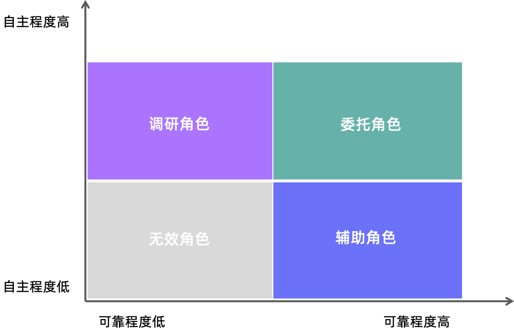

# 6.企业智能体的角色定位
当发掘出来合适的智能体场景后，智能体建设方和业务方经常产生分歧的一个点就是这个即将建设的智能体未来承担什么样的角色。从业务方出发，他们天然希望智能体的智能程度越高越好，最好能像真实的员工一样全天候在岗，高质量完成委托任务。但建设方则天然容易陷入从技术角度论证当前智能体能做到的智能程度，而论证结果常常不容易达到业务方的预期。这样分歧就会产生并有可能导致业务部门得出智能体不好用、不成熟的判断。要避免这个风险，首先就需要在业务方与建设方对于智能体的智能程度形成统一认知。
## 6.1.智能体的智能程度
结合前文对于智能体的定义，我们可以理解智能体的智能程度是要表达它能多大程度上完成人类委托给它的任务。这种委托程度可以从两个维度去评估：
- **可靠程度**：智能体能否准确理解任务需求、严格遵循规则执行任务，最终给出可靠结果；
- **自主程度**：智能体能否在执行过程中自主完成任务分解、执行、评估和反思，不需要（或者只需要少量）人类参与就能完成整个任务并给出结果；

智能体这两个方面的能力不仅受当前大模型能力的影响，还有很多其他相关因素，甚至部分还强依赖业务方的配合和其业务场景的数字化程度。具体来说，决定一个智能体在真实场景落地的智能程度包括如下几个方面：

- **大模型的能力**。业务场景的复杂度越高、专业领域越强，对大模型的知识要求和分析推理能力要求就越高。尤其是对于长流程的复杂场景，非常考验大模型对其复杂问题推理和指令遵循的能力；当大模型能力不足以支持更高程度的智能时，适当降低智能预期就成为一个理性的选择；
- **上下文环境**。企业内的投产智能体对于业务场景上下文要求会比简单的 AI 对话高很多。这主要体现在对业务场景专业性知识的储备，企业内关键数据与特殊流程规则的了解以及企业内各种工具的适配。在这个方面，业务方的数字化程度越高，配合 AI 做改造的积极性越好，就越能够提升智能体运行的上下文环境。
- **用户交互习惯**。用户与智能体的交互习惯也是影响智能体智能程度的关键因素。这包括两个方面，用户是否擅长用 AI 友好的方式与智能体交互（例如，提供高质量的用户提示词），另外一个方面是用户对于智能体的交互期待。在某些情况下，用户或许并不希望智能体全自主执行，或者从合规角度看用户仅希望参考智能体的输出结果而不是直接使用。所以，用户交互习惯很多时候也会影响智能体对智能程度的期待。
- **执行成本因素**。任何智能体投产都需要考虑投入产出比，何况现在智能体执行消耗的 Token 成本还比较高。在某些场景下，用户是愿意通过降低一定的智能程度来换取更好的成本效益。

基于以上几个因素的深入分析，业务方与建设方对于智能体的智能期待就能够具体化，而不是笼统得定义智能体够智能或者不够智能。同时，这种深入分析也更容易帮助双方建立对于智能体的预期，这样到投产阶段有助于形成使用-反馈-迭代循环的信任基础。

## 6.2.智能体的角色定位
有了对智能程度的清晰分析和合理预期。业务方就可以对智能体在场景中的运行角色建立准确的定位。总结来说，智能体的角色定位可以参考如下象限图：

  
  
图 4 ：智能体角色定位象限图

- **委托角色**：这是智能程度比较高的智能体。在具体业务场景中可以考虑将相关任务委托给智能体完成。当然，委托程度可以是一个逐步提升的过程。
- **辅助角色**：这类智能体擅长给出准确结果，但是因为模型能力或者上下文环境等原因还无法做到自主交付结果。所以，由它辅助人来完成任务是最合适的。这种角色有一个典型的交互模式，即人把任务交给智能体，由智能体给出准确决策和执行建议，但是最后需要人来手动按照智能体的建议完成执行。
- **调研角色**：这类智能体自主化执行能力强，但对于给出的结果由于缺乏校验机制，缺少高质量数据来源、进行总结推理形成可执行建议困难等原因无法直接使用。所以，这类角色智能体特别适合帮助人去广泛收集信息，做问题初步调研，并最终由人基于智能体输出结果做二次加工和确认，形成行动方案和结论。
- **无效角色**：落入这个区域的智能程度说明当前业务场景的智能体构建条件还不具备，不应该纳入当前构建范围之内。

当然，智能体角色定位是一个持续迭代的过程。由于各自内部或者外部条件的持续变化，业务方和建设方需要经常共同重新检视当前智能体的角色定位是否仍然有效，是否可以进一步提升角色定位。尤其是在当前大模型能力在快速成长，各种智能体生态技术持续成熟的当下，这种检视工作需要较高频率进行。
