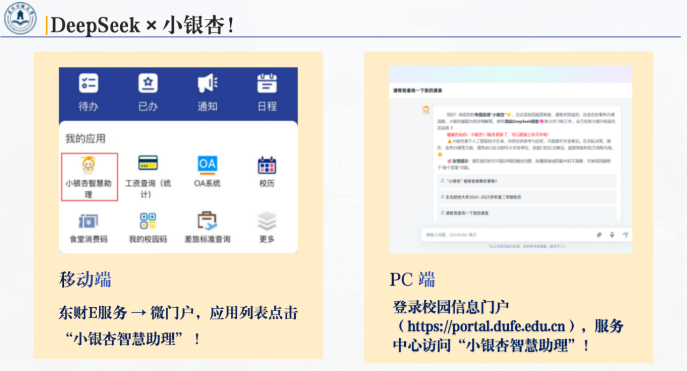

## 12.2.东北财经大学构建校园智慧 AI 助理 “小银杏”
### 12.2.1.东北财经大学介绍
东北财经大学位于辽宁大连，始建于 1952 年，是财政部、教育部与辽宁省共建的突出经济学、管理学优势和特色，经、管、法、文、理等多学科协调发展的财经大学。学校拥有应用经济学、统计学、工商管理三个 A 类学科，产业经济学、财政学等国家级重点学科，提供本科、硕士、博士完整人才培养体系。东财注重产学研结合，培养了大量高层次经济管理人才，被誉为“中国现代经济管理师的摇篮”。校园学术氛围浓厚，国际化程度较高，与多所海外高校保持合作，是中国具有重要影响的财经高等学府之一。

### 12.2.2.AI 转型需求
为引领财经教育 AI 转型，东北财经大学计划构建“数智东财”智慧教育新体系，全方位赋能教、学、研、管四大核心。
- **教学革新，AI 赋能教师提质增效**：推广 AI 备课辅助系统，为教师整合全球前沿财经案例与教学资源，一键生成个性化教案与习题。利用 AI 智能批改系统，实现客观题即时反馈与主观题智能批阅，解放教师劳力，使其聚焦于启发式、互动式教学。
- **学习变革，个性化全流程陪伴成长**：构建以学生为中心的智慧学习门户。课前，AI 助教推送预习资料并进行针对性前测；课中，基于数据分析支持分组与课堂有效讨论；课后，系统根据学习画像智能推荐拓展资源与进阶路径，实现课后自主拓展，培养终身学习能力。
- **科研创新，智慧平台驱动交叉融合**：打造财经大数据科研创新平台，集成多维度宏观经济、产业与企业数据，提供强大的计算能力与 AI 分析工具（如计量模型、文本分析），降低研究技术门槛，促进跨学科学术协作与前沿领域探索，催生高水平、创新性科研成果。
- **管理升级，数据驱动决策与精准服务**：建设校级智慧管理中枢，整合各业务系统数据。通过大数据分析，实现生源质量、教学质量、就业状况的全景评估与智能预警，提升管理效率与决策科学性，为师生提供精准、便捷的个性化服务，实现治理体系与治理能力现代化。

### 12.2.3.AI 转型之路
东北财经大学积极应对AI时代变革，系统推进AI技术与高校治理、教学科研及服务流程的深度融合，以智慧赋能发展，以创新重塑价值。基于 MaxKB 够构建与现有业务平台深度融合的 AI 智能体平台，东北财经大学在人工智能转型过程中的核心策略与实践思考如下：
- **团队组建先行**：学校高度重视人工智能转型中的人才与组织建设，系统推进跨学科、多背景的专业团队组建，为AI技术落地提供坚实支撑。
- **秉持长期发展理念**：人工智能技术迭代迅速，热点切换频繁。学校着眼于中长期规划，注重选择具备持续生命力的技术路线与应用架构，避免因短期技术变动影响整体布局。
- **坚持“应用为王”实施路径**：依托成熟的开源模型与平台，学校从易用性强、成效显著的轻量级应用切入，逐步拓展AI在管理、教学和服务等多维场景的覆盖。
- **打造校内智能问答助手**：当前重点推进基于RAG技术的智能问答系统建设，整合校内制度文件与办事流程，显著提升信息获取效率，增强师生对AI应用的体验感与认同感。
- **突出特色与风险控制并重**：针对高校人员结构清晰、角色权限相对固定的特点，系统设计时严格控制信息传播范围，强化数据隐私保护，确保AI应用安全合规、贴合教育实际。
- **推进系统融合与个性化服务**：实现与学校统一身份认证系统的深度融合，支持基于角色的分级访问，并结合用户上下文信息优化提示词设置，进一步提升问答准确性与服务针对性。
 
基于以上策略考量，东北财经大学最终选择 MaxKB 智能体平台作为 AI 应用开发平台。该产品凭借以下特性高度契合学校 AI 转型需求：
- **第一**：强大的 RAG 能力，可高效搭建本地 AI 知识库，支持文档上传与在线爬取，实现自动拆分与向量化处理，大幅提升问答效果；
- **第二**：快速接入第三方业务系统能力，无需编码即可嵌入企业微信、钉钉等平台，让现有系统快速获得智能问答功能；
- **第三**：产品坚持每月更新迭代，体现长期主义发展理念，确保持续优化与稳定服务。	
通过 MaxKB 平台的引入及上述措施的协同推进，东北财经大学正在构建符合高校特色、具备扩展性和可持续性的人工智能应用生态，为教育数字化转型提供坚实支撑，助力学校在智慧教育领域实现创新突破。

### 12.2.4.AI 转型效果呈现：“小银杏”
“小银杏”作为东北财经大学基于 MaxKB 开发的校园智慧 AI 助理，其诞生标志着学校在人工智能与教育深度融合领域迈出关键一步：
- **智能核心与知识管理**，“小银杏”的核心是智能问答，其知识库采用分类树状结构和精细权限管理，整合14个业务部门，各类文档 200 多项，实现门户网站、教务网站等通知新闻自动采集入库，通过模型和人工标注进行向量化并入库。
- **认证融合与便捷访问**，MaxKB 平台与统一身份认证平台深度集成对接，构建企业级微门户一体化应用解决方案。通过单点登录，实现用户一次认证即可访问所有授权系统资源，同时支持通过微信公众号或企业微信实现一键授权调用功能。
“小银杏”从设计之初就旨在超越传统微门户，成为一个智能 PaaS 平台。它通过自然语言（NL）交互，打通异构系统，支持师生高效信息检索与业务办理，初步形成了“基础服务+学科延伸”的智慧生态。
 

图 22 ：“小银杏”移动端与PC端
 

图 23 ：“小银杏”与身份认证平台融合

 
### 12.2.5.总结
东北财经大学深刻认识到人工智能技术对高等教育的颠覆性影响，积极布局未来 AI 转型战略。通过将现有业务系统、内部数据库、制度规范与大模型深度融合，构建具有领域知识的“智慧大脑”，从而显著提升管理效能与教学科研创新力。东北财经大学基于 MaxKB 打造的“小银杏”智能平台，将成为学校 AI 战略转型的核心载体和创新引擎。该平台深度融合校内知识体系与 AI 能力，通过 RAG 技术实现精准知识服务，以“小银杏”为数字基座，学校将持续推进业务场景智能化重构，加速从“事务处理”向“自主决策”演进，逐步建成覆盖教学、管理、科研全场景的智能体生态。
