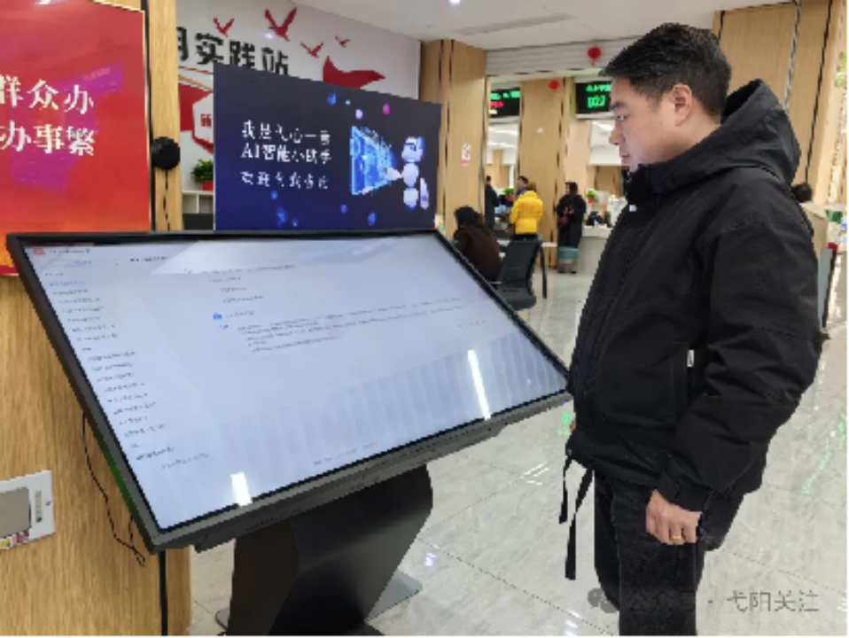

## 12.3.弋阳县政府构建"弋心一意"小助手提升企业群众办事体验和满意度
### 12.3.1.弋阳县政府介绍
弋阳县是江西省上饶市下辖县，位于江西省东北部、信江中游，东邻横峰县，南接铅山县，西毗万年县、贵溪市，北连德兴市、乐平市。县域总面积 1580 平方公里。截至2023年末，常住人口约33.2万人。弋阳交通便利，浙赣铁路、沪昆高速铁路、320国道、沪昆高速公路穿境而过。经济以农业、工业和服务业为主导，形成了食品、建材、采矿等特色产业。

### 12.3.2.弋阳县政务服务大厅AI需求
弋阳县行政审批局将提升服务效能、优化群众办事体验作为工作的重中之重。近年来，行政审批局围绕“最多跑一次”改革目标取得了一定成效，但在实际工作中发现企业群众在政务服务大厅办事时，仍常受到以下两类问题的困扰：
- **问题一**：材料准备过程繁琐，不少群众和企业对申请材料的具体要求理解不清，准备时容易遗漏或格式不符，导致反复修改、补充，甚至不得不“多次跑”，费时又费力。
- **问题二**：咨询解答效率有待提高，尤其在办事高峰时段，咨询台压力大，简单问题占用大量人力，而一些相对复杂的问题却难以得到即时、专业的解答，影响了整体服务体验。
针对这些问题，行政审批局积极借助数字化手段寻求突破。行政审批局期望引入AI技术，打造一位24小时在线的“智能办事员”。
- **问题三**：AI智能导办和材料预审系统，为企业群众提供精准、清晰的材料清单和填报指引，实现“一次性告知、一次性办好”；
- **问题四**：AI客服高效解答大部分常规咨询，释放人力专注于处理复杂个案和提供更有温度的服务。希望AI的赋能将进一步提升服务效率与质量，让“最多跑一次”真正成为群众身边温暖而便捷的现实。

### 12.3.3.弋阳县政务服务大厅引入 AI 助手
为进一步提升政务服务质效，弋阳县积极探索“弋心一意+AI”智慧服务新模式，组织技术团队完成人工智能模型的本地化部署，融合 DeepSeek 与通义双大模型能力，以数据赋能推动企业群众办事便捷度和满意度再上新台阶。2025 年 2 月，基于 MaxKB 平台打造的“弋心一意”AI小助手正式在县政务服务大厅导服台投入使用。该助手通过系统梳理大厅各窗口高频事项的办事指南和材料流程，全面接入通义和 DeepSeek 大模型，并运用检索增强生成（RAG）技术，为企业群众提供精准、高效的政务咨询服务，实现了从“人找服务”到“服务找人”的智慧转变，真正让“弋心一意”成为弋阳政务便民利企的新名片。
 

图 24 ：“弋心一意”AI助手在政务大厅

### 12.3.4.企业群众收益
"弋心一意" AI 小助手已成为弋阳县政务服务中心“智慧政务”建设的一项标志性成果，有效提升了企业群众的办事体验和满意度。该助手通过深度融合 DeepSeek 与通义双大模型，结合检索增强生成（RAG）技术，实现了智能问答、材料一键预览和跨窗口联办功能，为企业群众提供清晰、精准的全程办事指引。在语音交互方面，“弋心一意” AI 小助手具备前端语音提问、后台实时语义识别与知识库精准检索能力，真正做到了以语音反馈快速解答问题，极大降低了群众使用门槛。系统实现了从“人机对话”到“业务即办”的高效衔接，切实解决了企业群众在办事过程中遇到的多种问题，显著提高了政务服务的响应速度和便捷度。“弋心一意”AI小助手已成为弋阳县便民服务体系中广受认可的数字化成果，充分体现了“弋心一意”服务品牌的技术内涵与人文温度。

### 12.3.5.未来展望
弋阳县将根据试点成效逐步丰富“弋心一意” AI 小助手的知识库，打通“弋心一意”管理系统，通过整合政务信息资源和政务数据，开发“弋心一意” AI 小助手特色应用，打通政务服务的“最后一米”，实现政务服务大厅和乡镇便民服务中心高效管理协作，提升办事效率，促进政务服务更加智能化，推动弋阳数字政府建设高质量发展。
